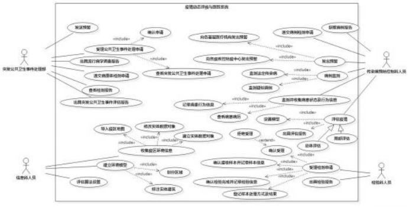
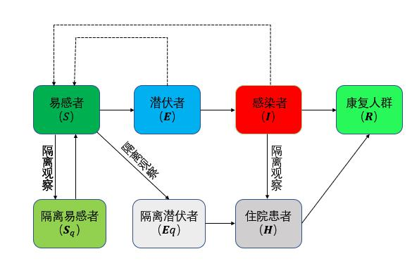
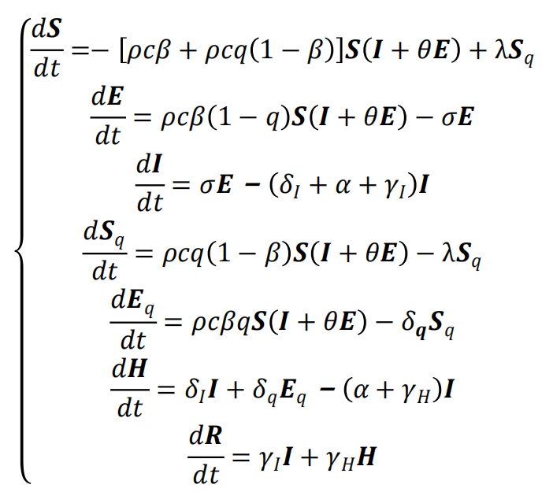
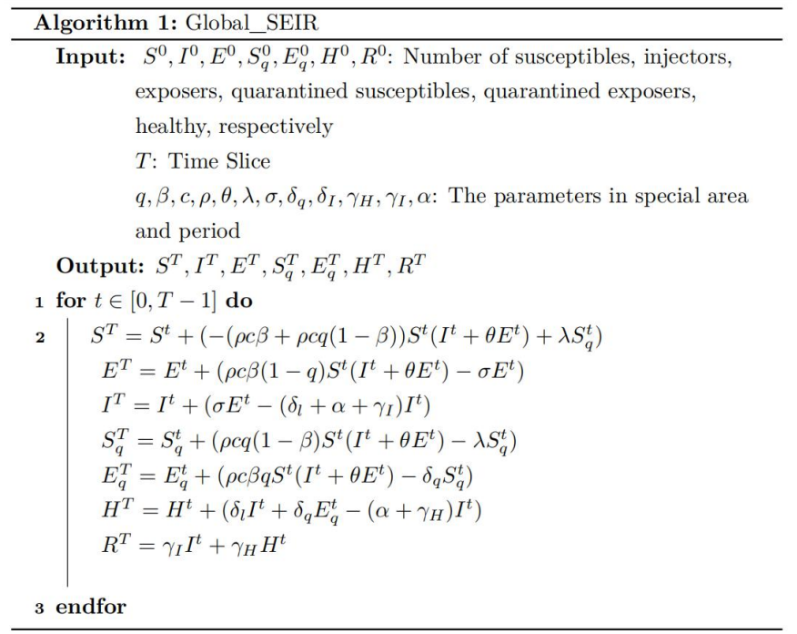
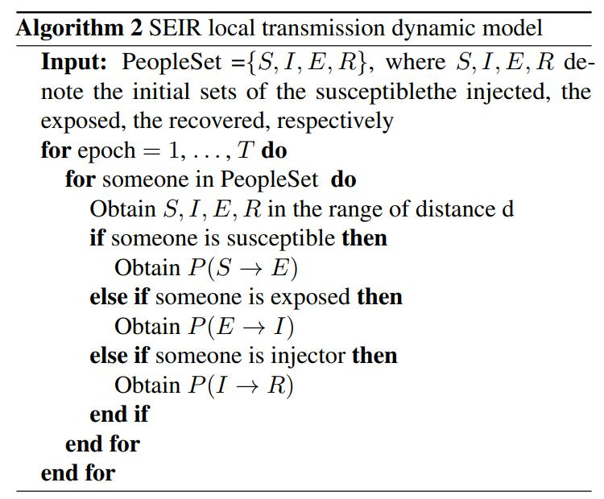
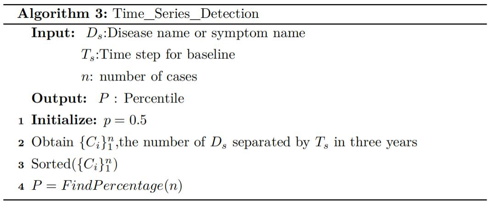
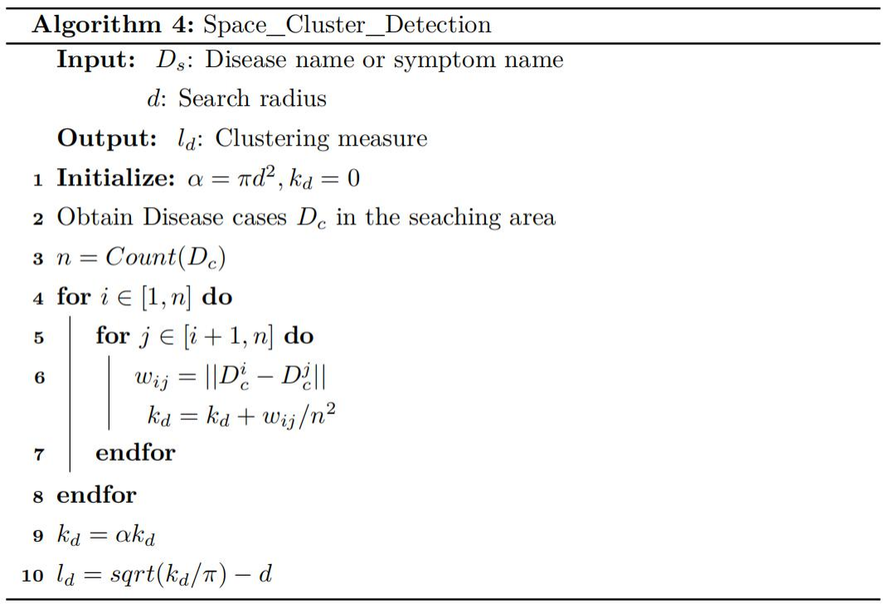
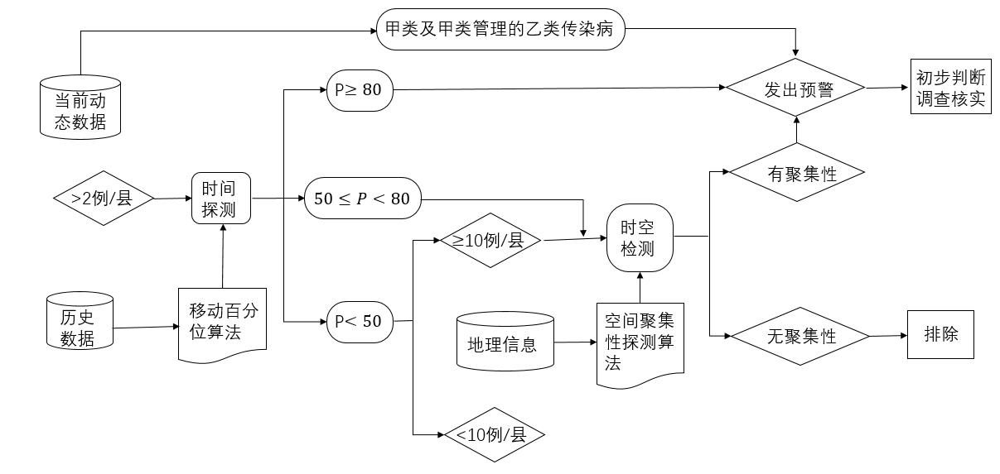
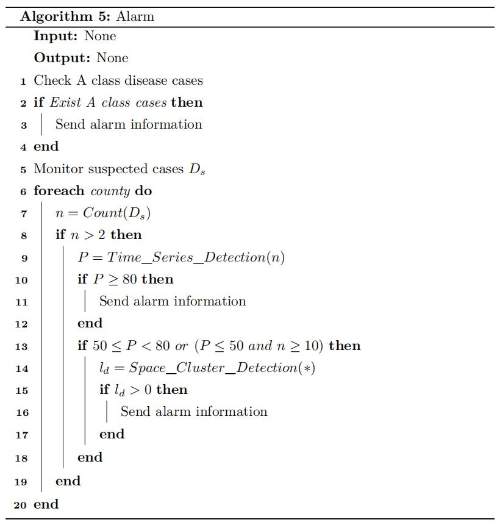

# 疫情动态评价与跟踪系统

## 1.  总体说明

### 1.1 项目概述

#### 1.1.1 背景

二十一世纪，非典、埃博拉等未知病毒逐渐猖獗，人类的防疫措施在不断地接受考验， 现有的疫情动态系统更多地强调面向非参与人员的总体观测，对于更好地处理疫情问题却没 有更加积极的帮助。而面对上下级之间对疫情内容认识不均衡以及可能存在的瞒报问题等， 仍然存在种种缺陷。

#### 1.1.2 意义

为了更好地辅助疫情工作人员，本项目主要设计一款以疫情工作者为中心的疫情信息动 态评估与跟踪系统，本系统将能够针对疫情工作人员的信息录入和反馈进行处理，并且辅助 以仿真模型进行动态评估。

#### 1.1.3 编写目的

本文档的编写目的主要是提供疫情动态评估与跟踪系统的需求分析说明，帮助该系统的 设计人员更好地完成分析和设计。

### 1.2 业务模型

#### 1.2.1 业务用例图

 

#### 1.2.2 业务描述

当出现公共卫生突发事件，但还未出现疫情时，**突发公共卫生事件处理部人员**在系统内 进行信息处理，分析公共卫生突发事件可能是由什么传染病引起，公共卫生突发处理部人员 还将对感染者的症状进行监测，并将结果输入进入系统；**检验科人员**对细菌、病毒等进行病 原微生物检验，检验科人员还进行血清学检验、分子生物学检验、各类毒物、污染物的检验 鉴定以及毒理学检验，并将各类检验结果输入到系统。

当已经出现的疫情，**检验科人员**对病原体进行病理学和毒理学进行检验，得出检验报告， 并将报告输入系统，系统将报告发送给各级疾控 (内部) 和各级政府 (外部) ；**信息科人员**统计感染者的行为信息等输入系统，将疫情出现地区的环境信息输入仿真系统中；**传染病预防控制部人员**首先对疫情总体趋势在系统内进行评估，根据已有的统计信息评估疫区，通过 仿真的系统评估潜在传播人员高危地区。

### 1.3 用户范围

| 角色  | 职责描述 |
| --- | --- |
| 突发公共卫生事件处理 部人员 | 处理突发的公共卫生事件，对可能会出现的疫病进行预警 |
| 检验科人员 | 对送达的待检验样本进行各类检验，并将检验报告输入系统 |
| 信息科人员 | 对感染者和疫情地区的信息进行收集和处理并输入系统 |
| 传染病预防控制部人员 | 对整体和某区域的疫情状况进行评估，给外部系统提供防控建议 |

### 1.4 词汇表

| 词汇  | 描述 (术语与缩写的描述) |
| --- | --- |
| 疫病  | 发生在人、动物、或植物身上，并具有可传染性的疾病的统称，一般 由寄生虫、细菌、病毒等微生物引起 |
| 疫情  | 指社会上正在发生的疫病感染的状况 |
| 疫情工作人员 | 主要是指负责检测疫病、负责记录和传递有关疫病信息的人员，包括 突发公共卫生事件处理部人员、检验科人员、信息科人员、传染病预 防控制部人员 |
| 系统  | 本文档中系统主要特指疫情动态评估与跟踪系统 |

### 1.5 非功能需求

| 需求  | 描述  |
| --- | --- |
| 可操作性 | 界面简约清晰，操作便捷 |
| 一致性 | 在不同设备上保持数据一致 |
| 故障发生周期 | 平均每次故障发生的周期大于 1 个月 |
| 平均故障修复时 间 | 平均每次故障修复的时间小于 3 天 |
| 安全性 | 恶意用户不能损坏该系统或数据库 |
| 事务响应时间 | 每个用户平均每个事务的响应时间小于 1 秒 |
| 吞吐量 | 整个系统平均每秒处理大于 20 个事务 |
| 容量  | 整个系统平均支持大于 50 个用户同时操作 |
| 资源消耗 | 不占用过多内存，消耗极少的磁盘空间，对通信强度和速度影响甚微 |

## 2. 用例

该系统分为 4 个模块，分别为发公共卫生事件处理部模块、检验科模块、信息科模块和 传染病预防控制部模块。总用例图如下图所示。

## 3. 领域模型

### 3.1 SEIR 传播动力学模型

考虑潜伏期患者病毒传播能力和追踪隔离干预措施对疫情作用 **SEIR 传播动力学模型**。

#### 3.1.1 总体模型

经典 SEIR 模型将人群分为**易感者**（susceptible, $S$）、**感染者**（infected, $I$）、**潜伏**

**者**（exposed, $E$）和**康复人群**（recovered, $R$）。该模型还假设人群中所有个体都有被感染 的概率，当被感染个体痊愈后，即康复人群 R 不会再被感染。考虑到防治传染病的隔离措 施，模型中的人群组别新增隔离易感者$S_q$ 、隔离潜伏者$E_q$ 和隔离感染者 $I_q$ 。鉴于隔离感染者会立即送往定点医院隔离治疗，因此这部分人群在本模型中全部转化为住院患者 $H$。此系 统模型用 $S,I,E$ 分别指隔离措施遗漏的易感者、感染者和潜伏者。隔离易感者解除隔离 后重新转变为易感者，而感染者和潜伏者均有不同程度的能力感染易感者转化为潜伏者。

- 易感者 $S$ 向隔离易感者 $S_q$ 的转化速率为 $\rho cq(1 一 \beta)$；
  
- 易感者 $S$ 向隔离潜伏者 $E_q$ 的转化速率为 $\rho cq\beta$；
  
- 易感者 $S$ 向潜伏者 $E$ 的转化速率为 $\rho c\beta(1 一 q)$。
  

其中 $q$ 为隔离比例, $\beta$ 为传染概率, $c$ 为接触率, $\rho$ 为有效接触系数, $pc$ 为有效接触率(单位时间决定模型参数的设定) 。同时考虑到非隔离的感染者 $I$ 和潜伏者 $E$ 对易感人群的影响，又有隔离解除的易感者 $S_q$ 重新转变为 $S$，因此易感者人数控制方程为：

$\frac{dS}{dt}=-[\rho c\beta+\rho cq(1-\beta)]S(I+\theta E)+\lambda S_q$

其中 $\theta$ 是潜伏者相对于感染者传播能力的比值，简单起见假设潜伏期患者与已表现出症 状患者的传染能力相同，即 $\theta=1$ 。入是隔离解除速率，此系统模型取 $\lambda=\frac{1}{14}$ 。

对于潜伏者人数的控制方程为：

$\frac{dE}{dt}=\rho c\beta (1-q)S(I+\theta E)-\sigma E,$

其中，$\sigma$ 为潜伏者向感染者的转化速率，此系统模型取 $\sigma=\frac{1}{7}$ 。

对于感染者人数的控制方程为：

$\frac{dI}{dt}=\sigma E-(\delta_I +\alpha + \gamma_I)I,$

其中，$\delta_I$是感染者的隔离速率，$\alpha$ 为病死率，$\gamma_I$ 是感染者的恢复率。

对于隔离易感者人数的控制方程为：

$\frac{dS_q}{dt}=\rho cq(1-\beta)S(I+\theta E)-\lambda S_q.$

对于隔离潜伏者人数的控制方程为：

$\frac{d E_q}{dt}=\rho c\beta(I+\theta E)-\delta_q S_q,$

其中 $\delta_q$ 是隔离潜伏者向住院患者的转化速率。

对于住院患者人数的控制方程为：

$\frac{dH}{dt}=\delta_I I +\delta_q E_q -(\alpha + \gamma_H)I,$

其中 $\gamma_H$ 是隔离感染者的恢复速率。 

对于康复人数的控制方程为：

$\frac{dR}{dt}=\gamma_I I + \gamma_H H.$

最后我们得到如下所示的微分方程组：

**算法：SEIR 总体传播动力学模型伪代码如下：**

#### 3.1.2 局部模型

考虑实际情景，在距离 $d$ 范围内（不考虑医院的一个区域），$S_q,E_q,H$ 是不会出现在此范围内，故 $\lambda=0$ 。局部模型需要求得单个个体状态转移概率。

已知单个个体的 ݀$d$ 距离范围内的某时刻的统计感染数据：$S,I,E,R$。接下来计算单位时间内单个个体的状态变化概率（单位时间决定模型参数的设定）。

对于单个易感者向潜伏者状态转移概率为：

$P(S\rightarrow E)=\rho c\beta (I+\theta E)$

对于单个潜伏者向感染者的状态转移概率为：

$P(E\rightarrow I)=\sigma$

对于单个感染者向住院患者的状态转移概率为：

$P(I\rightarrow R)=\gamma_I$

**算法：SEIR 局部传播动力学模型**

### 3.2 预警模型

#### 3.2.1 基于时间序列的异常探测

采用控制图移动百分位数法的基本原理，根据既往的同期(近 3 年)历史周期的发病数(采用加权的方法尽量排除爆发疫情对周期历史发病水平的影响)，对基线数据采用 $7d$ 为一个观察期（消除周末效应同时增加数据稳定性），即当前观察周期病例数($C_0$ )为最近 $7d$ 的病例数之和。通过移动计算百分位数的方法计算不同水平的百分位数作为候选预警阈值，例如此预警系统可采用第 50 百分位数。

**算法：基于时间序列的异常探测**

#### 3.2.2 基于空间聚集性的探测

利用 **Riple’s K 函数法**进行空间聚类分析。采用在地图中建立活动圆形窗口扫描病例的方法，将区域内的病例标识在地图上，按照半径 $d$ 的搜索圆范围来统计点数量，对所有病例样本点对之间的距离计算其平均值。然后用该平均值初一研究区域内的样本密度，得到函

数值 ݇$k(d)$：

$k(d)=a\sum^{n}_{i=1}\sum^{n}_{j=1}\frac{w_{ij}(d)}{n^2},$

其中，$a$ 为研究区域面积，$n$ 为研究区域内病例样本点数量，$w_{ij}(d)$ 为在半径 $d$ 的搜索

圆内的样本点 $i$ 和样本点 ݆$j$ 之间的距离。为保持方差稳定性，将 ݇$k(d)$ 进行转换为$l(d)$ ݀ ：

$l(d)=\sqrt{\frac{k(d)}{\pi}}-d$

在完全随机分布的假设下，$l(d)=0$；若 $l(d)<0$ ，则认为病例呈均匀分布；݈若 $l(d)>0$，则认为病例**呈现聚集分布**。空间聚集性的假设采用蒙特卡洛法，获得不同距离尺度的 ݈$l(d)$ 的置信区间，并绘制包络线。当实际算得的 ݈$l(d)$ 位于包络线上，则认为**存在距聚集性**。

**算法：基于空间聚集性的探测**

#### 3.2.3 预警流程规则

首先通过时间系列的移动百分位数法对当前监测数据进行运算，当前周期值 <P50  (预警参数) 时，如果以县(区、市、旗，下同)为单位病例 < 10 例时，结束运算。≥ 10 侧时启动 空间聚集性探测运算；> P80 时直接发出预警；当周期值为 P50 ~ P80 时，启动空间聚集性探 测运算，无聚集性则结束运算，有聚集性则直接发出预警。对于甲类及按甲类管理的乙类传染病，以县为单位病例 > 2 例时，直接发出预警。如下图所示：

**算法：预警模型**

#### 3.2.4 工作流程

监测人员通过传染病爆发早期预警信息系统提供的参数设置和展示程序所提供的界面， 设置各项预警参数，并保存到主数据库的数据表中。从每天零点开始，在当日传染病数据统 计表的基础上，生成监测地区聚集性运算所需要的特定格式的统计数据，并将其拷贝保存到 专门的数据表中备用。在统计数据生成之后，系统自动将用户设定的参数数据和统计数据推 送到运算数据库中，并在完成时通知监测地区聚集性运算程序即时进行计算。在参数数据和 统计数据推送到运算数据库后，系统自动启动相关的地区聚集性运算程序进行运算，并且将 结果存储到计算数据库中。系统自动将计算数据库上的结果数据取回到主数据库中，并通过 短信等通知方式通知预警结果。监测人员通过“预警信息系统”的参数设置和展示程序提供 的详细界面并查看预警结果的相应信息。